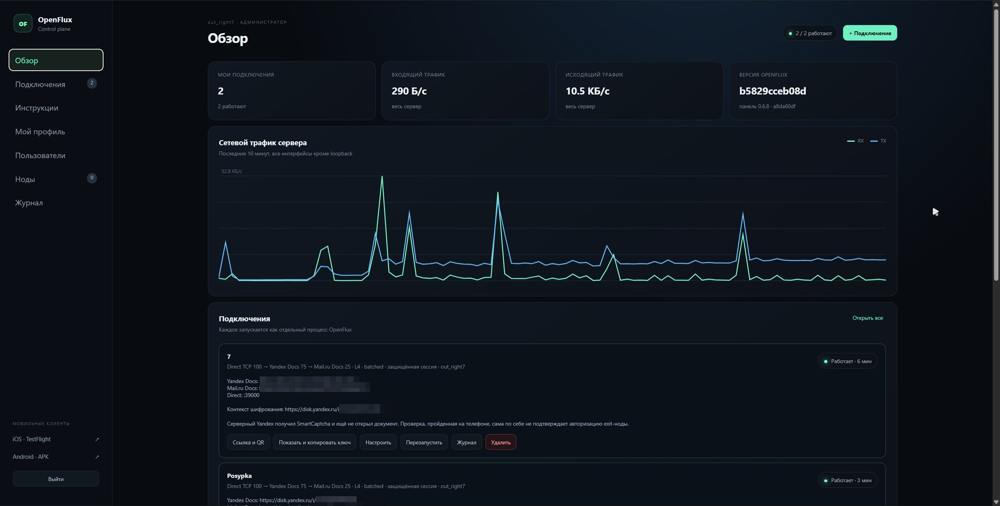
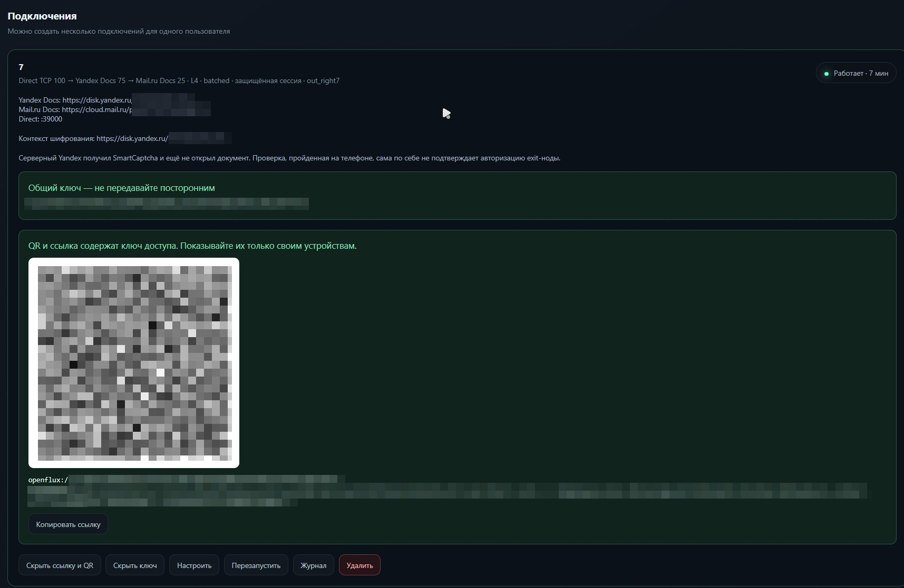
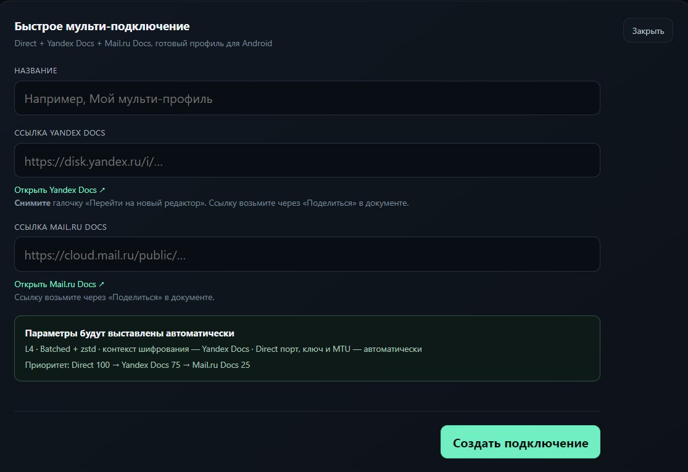
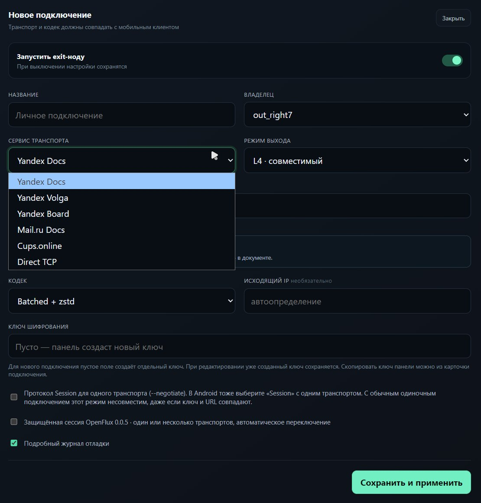
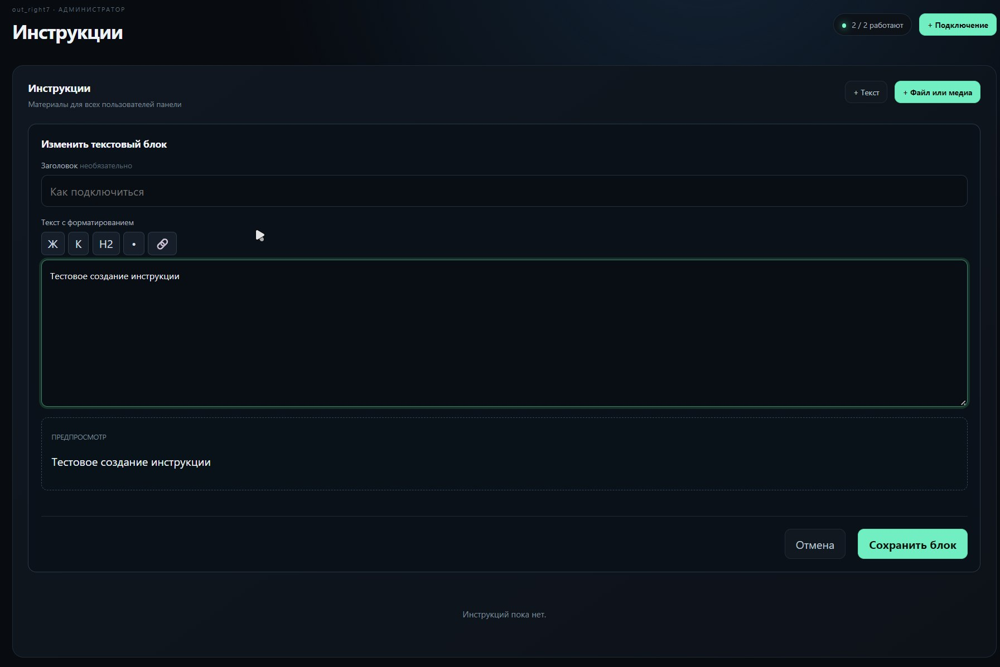
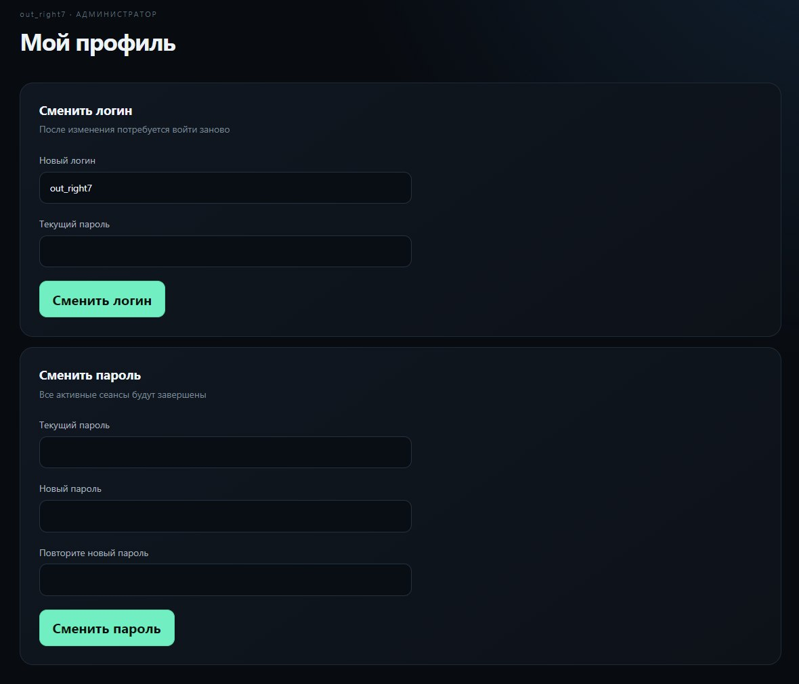
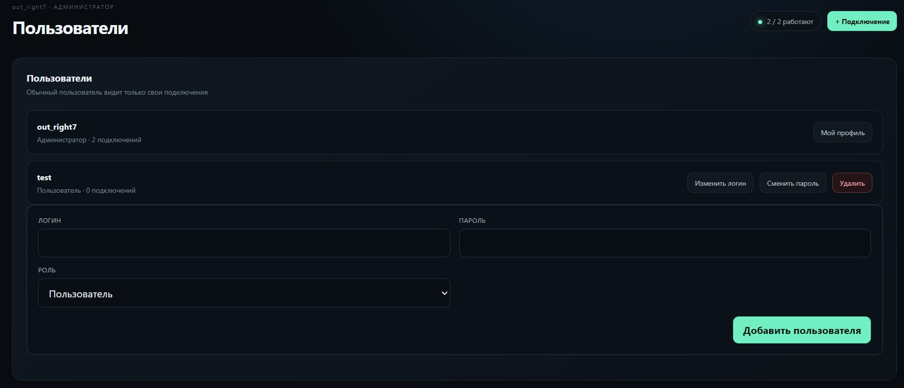
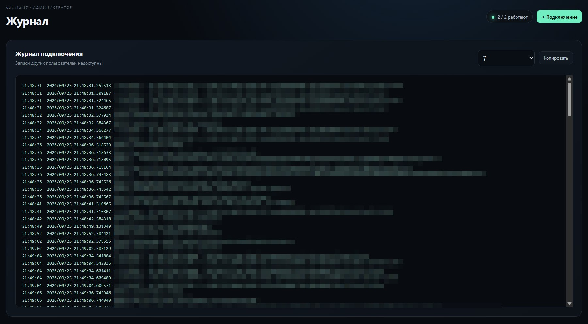
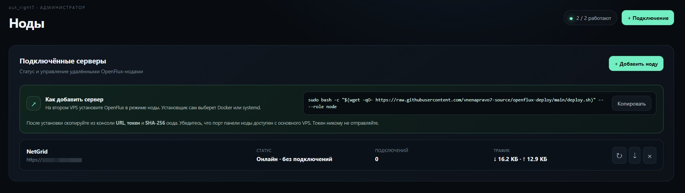

<div align="center">

# OpenFlux Deploy

**OpenFlux-сервер и веб-панель для простого управления подключениями**

Установка одной командой · Docker / systemd · пользователи · QR-профили · ноды

[Установка](#установка) · [Возможности](#возможности) · [Мобильные приложения](#мобильные-приложения) · [Проекты и лицензии](#проекты-и-лицензии)

</div>

---

## Установка

На VPS с правами root выполните:

```bash
sudo bash -c "$(wget -qO- https://raw.githubusercontent.com/vnenapravo7-source/openflux-deploy/main/deploy.sh)"
```

Установщик сам выберет Docker (если установлен Docker Compose) или systemd. При желании укажите режим явно:

```bash
# systemd
sudo bash -c "$(wget -qO- https://raw.githubusercontent.com/vnenapravo7-source/openflux-deploy/main/deploy.sh)" -- --mode systemd

# Docker
sudo bash -c "$(wget -qO- https://raw.githubusercontent.com/vnenapravo7-source/openflux-deploy/main/deploy.sh)" -- --mode docker
```

После установки сохраните адрес панели и данные входа, показанные в консоли.

## Возможности

<table>
<tr><td><b>Транспорты</b></td><td>Yandex Docs, Volga, Board, Mail.ru Docs, Cups.online и Direct TCP</td></tr>
<tr><td><b>Подключения</b></td><td>Одиночные и быстрый мульти-профиль; отдельные ключи, ссылки <code>openflux://</code> и QR-коды</td></tr>
<tr><td><b>Пользователи</b></td><td>Роли, отдельные подключения и журналы, смена логина и пароля</td></tr>
<tr><td><b>Наблюдение</b></td><td>Статус, журналы, трафик и удалённые серверы-ноды</td></tr>
<tr><td><b>Обслуживание</b></td><td>Проверка и установка обновлений, автообновление и откат сервера и панели</td></tr>
<tr><td><b>Инструкции</b></td><td>Редактируемые материалы: форматированный текст, фото, видео и файлы</td></tr>
</table>

## Скриншоты

Нажмите на изображение или «Открыть полный размер», чтобы посмотреть скриншот отдельно.

> **Важно о нодах:** пока это только визуальная часть панели. Создание подключений на удалённых нодах и перенос между серверами ещё не реализованы.

<table>
<tr><td align="center"><b>Обзор</b><br><a href="https://raw.githubusercontent.com/vnenapravo7-source/openflux-deploy/main/assets/screenshots/overview.jpg"></a><br><sub><a href="https://raw.githubusercontent.com/vnenapravo7-source/openflux-deploy/main/assets/screenshots/overview.jpg">Открыть полный размер ↗</a></sub></td><td align="center"><b>Подключения и QR</b><br><a href="https://raw.githubusercontent.com/vnenapravo7-source/openflux-deploy/main/assets/screenshots/connections.jpg"></a><br><sub><a href="https://raw.githubusercontent.com/vnenapravo7-source/openflux-deploy/main/assets/screenshots/connections.jpg">Открыть полный размер ↗</a></sub></td></tr>
<tr><td align="center"><b>Быстрое мульти-подключение</b><br><a href="https://raw.githubusercontent.com/vnenapravo7-source/openflux-deploy/main/assets/screenshots/quick-multi.jpg"></a><br><sub><a href="https://raw.githubusercontent.com/vnenapravo7-source/openflux-deploy/main/assets/screenshots/quick-multi.jpg">Открыть полный размер ↗</a></sub></td><td align="center"><b>Новое подключение</b><br><a href="https://raw.githubusercontent.com/vnenapravo7-source/openflux-deploy/main/assets/screenshots/new-connection.jpg"></a><br><sub><a href="https://raw.githubusercontent.com/vnenapravo7-source/openflux-deploy/main/assets/screenshots/new-connection.jpg">Открыть полный размер ↗</a></sub></td></tr>
<tr><td align="center"><b>Инструкции</b><br><a href="https://raw.githubusercontent.com/vnenapravo7-source/openflux-deploy/main/assets/screenshots/instructions.jpg"></a><br><sub><a href="https://raw.githubusercontent.com/vnenapravo7-source/openflux-deploy/main/assets/screenshots/instructions.jpg">Открыть полный размер ↗</a></sub></td><td align="center"><b>Профиль</b><br><a href="https://raw.githubusercontent.com/vnenapravo7-source/openflux-deploy/main/assets/screenshots/profile.jpg"></a><br><sub><a href="https://raw.githubusercontent.com/vnenapravo7-source/openflux-deploy/main/assets/screenshots/profile.jpg">Открыть полный размер ↗</a></sub></td></tr>
<tr><td align="center"><b>Пользователи</b><br><a href="https://raw.githubusercontent.com/vnenapravo7-source/openflux-deploy/main/assets/screenshots/users.jpg"></a><br><sub><a href="https://raw.githubusercontent.com/vnenapravo7-source/openflux-deploy/main/assets/screenshots/users.jpg">Открыть полный размер ↗</a></sub></td><td align="center"><b>Журнал</b><br><a href="https://raw.githubusercontent.com/vnenapravo7-source/openflux-deploy/main/assets/screenshots/logs.jpg"></a><br><sub><a href="https://raw.githubusercontent.com/vnenapravo7-source/openflux-deploy/main/assets/screenshots/logs.jpg">Открыть полный размер ↗</a></sub></td></tr>
<tr><td align="center"><b>Ноды</b><br><a href="https://raw.githubusercontent.com/vnenapravo7-source/openflux-deploy/main/assets/screenshots/nodes.jpg"></a><br><sub><a href="https://raw.githubusercontent.com/vnenapravo7-source/openflux-deploy/main/assets/screenshots/nodes.jpg">Открыть полный размер ↗</a></sub></td></tr>
</table>

## Мобильные приложения

- [Android-приложение](https://github.com/damnurmum/OpenFlux-Android) · [скачать последнюю версию](https://github.com/damnurmum/OpenFlux-Android/releases/latest)
- [iOS TestFlight](https://testflight.apple.com/join/BwnAcdus)

## Проекты и лицензии

- **Панель и установщик:** [vnenapravo7-source/openflux-deploy](https://github.com/vnenapravo7-source/openflux-deploy) · [GPL-3.0](LICENSE)
- **Серверное ядро:** [p1neappleXpress/OpenFlux](https://github.com/p1neappleXpress/OpenFlux) · [GPL-3.0](https://github.com/p1neappleXpress/OpenFlux/blob/main/LICENSE)
- **Android-клиент:** [damnurmum/OpenFlux-Android](https://github.com/damnurmum/OpenFlux-Android) · [GPL-3.0](https://github.com/damnurmum/OpenFlux-Android/blob/main/LICENSE)

<sub>Ядро OpenFlux поддерживается авторами основного проекта. Здесь развиваются установщик и панель управления.</sub>
